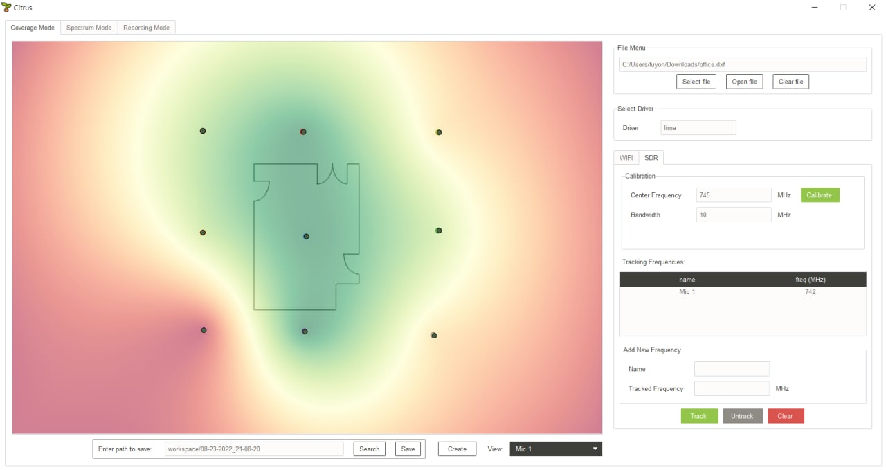
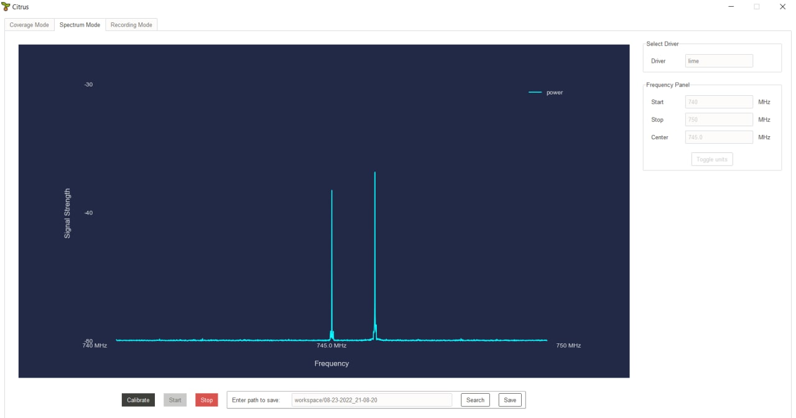
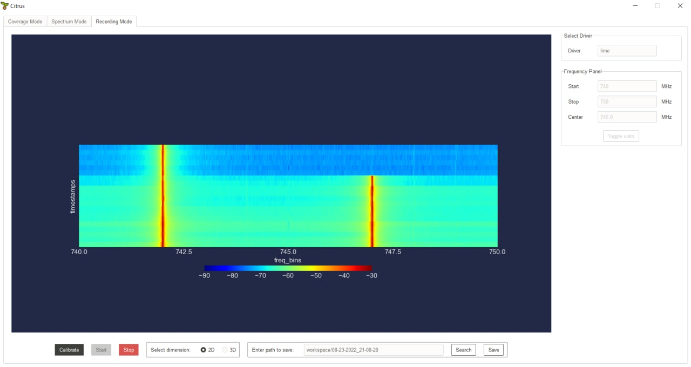
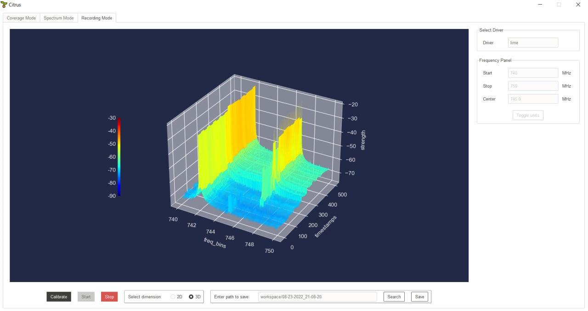

# Citrus

Citrus is a visualization tool for analyzing Wireless and RF signals using Software Defined Radio (SDR).

There are three modes in Citrus: **Coverage**, **Spectrum** and **Recording** mode.

The **Coverage** mode allows users to upload a floorplan and analyze WiFi or RF signals.

The **Spectrum** mode shows a snapshot of RF signals.

The **Recording** mode shows RF signals over time, in both 2D and 3D modes.

