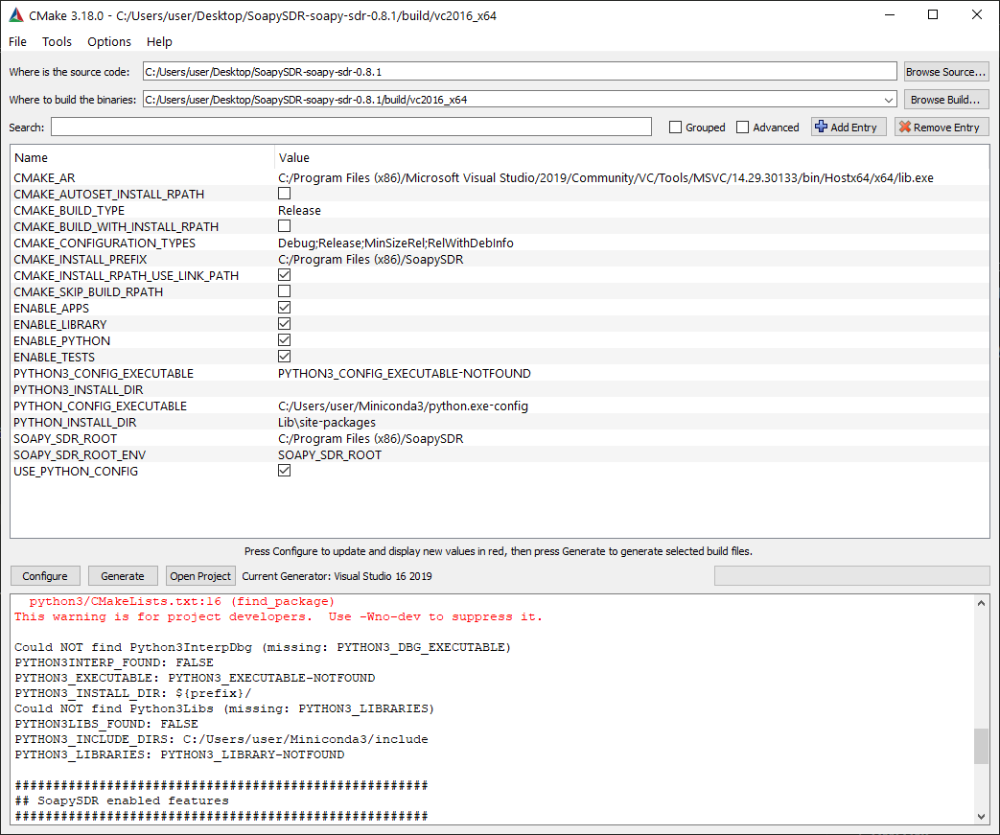
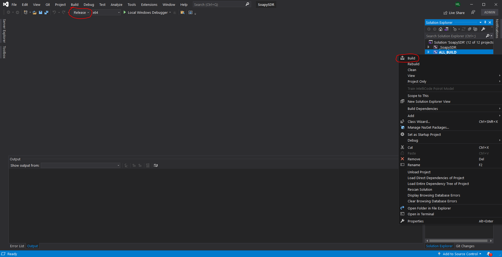
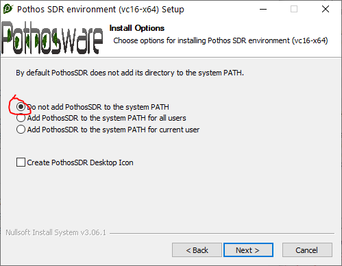
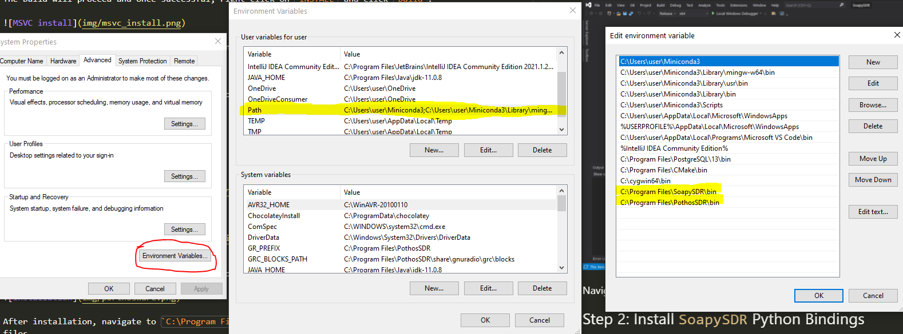
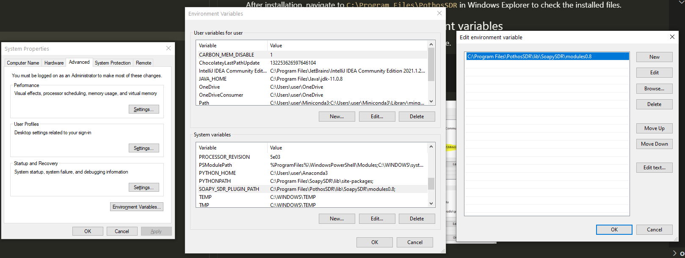
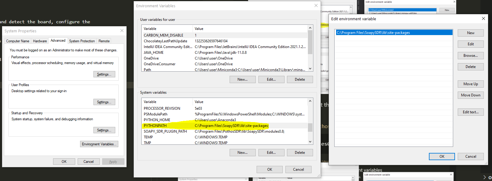
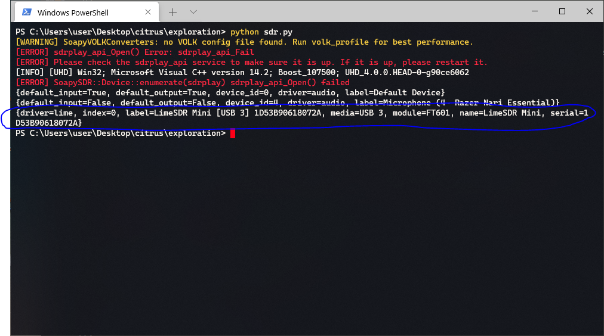

# Windows Setup

To setup the PC for LimeSDR and `SoapySDR`, an API to communicate with SDR. This version is only tested on Windows 10.

The setup is done in the following sequence:

1. Build and install `SoapySDR`.
2. Install `SoapySDR` Python Bindings (Recommand using `conda`).
3. Install `LimeSuite` from PothosSDR.
4. Configuring PATH variables.

## Theory behind Setup

Since LimeSDR's `pyLMS7002Soapy` [library](https://github.com/myriadrf/pyLMS7002Soapy) already uses `SoapySDR`, it is good to understand how it works.

According to `SoapySDR`'s [wiki page](https://github.com/pothosware/SoapySDR/wiki), SoapySDR is platform neutral independent SDR support library that provides Python bindings (on top of their C++ code).


`SoapySDR` follows a [Plugin architecture](https://github.com/pothosware/SoapySDR/wiki#id6) and allows runtime-loadable modules. This means that it supports multiple SDR types in modules (may resemble dll files).

This means that these dlls directory location must be saved in `SOAPY_SDR_PLUGIN_PATH` path in the system variables of PC.

## Step 0: Install LimeSDR USB Driver

If the Device Manager shows a warning at the USB driver of LimeSDR, then follow this guide: [here](https://wiki.myriadrf.org/LimeSDR-Mini_driver_installation) to install the drivers.

The driver can be downloaded from [here](www.ftdichip.com/Drivers/D3XX.htm).

## Step 1: Build and Install `SoapySDR`

Choose either ways.

### Method 1: Shortcut

Get the pre-built `SoapySDR` and unzip the compressed folder directly.

### Method 2: Gung-ho version

Note: This step is highly dependent on the OS performing build. Meaning Windows 10 build for Windows 10, Intel for Intel, 64-bit for 64-bit etc.

Ensure that Python3, CMake and Visual Studio MSCV (at least 2019) is installed.

Open CMake with __administrator privilege__!! This is important as installation to the Program Files folder requires the admin rights.

Run CMake and perform an Out-of-Source build (i.e. saving the build files in another directory separate from source code).

Configure and generate the build system by clicking on `Configure`, then `Build`.



Click on `Open Project` to launch the MSVC.

Ensure that the build version is set to `Release` and right-click on `ALLBUILD` and click `build`.



The build will proceed and once successful, right-click on `INSTALL` and click `build`.


Navigate to `C:\Program Files\SoapySDR` in Windows Explorer to check the installed files.

## Step 2: Install `SoapySDR` Python Bindings

Launch Powershell and execute the command below to install `SoapySDR` Python in Python shipped in Conda.

```bash
conda install -c conda-forge soapysdr
```

Type `Y` when prompted to allow installation.

_Source: [here](https://anaconda.org/conda-forge/soapysdr)_

## Step 3: Install `LimeSuite` from PothosSDR

Go to [here](http://wiki.myriadrf.org/Lime_Suite) to download the LimeSDR driver, which is bundled with the PorthoSDR application.

Download and install. DO NOT ADD TO PATH, errors will occur! (We'll have a walkaround later)



After installation, navigate to `C:\Program Files\PothosSDR` in Windows Explorer to check the installed files.

## Step 4: Configure PATH and Environment variables

There are some paths you need to add to the PATH variable.

```windows
C:\Program Files\SoapySDR\bin
C:\Program Files\PothosSDR\bin
```



Next, to allow `SoapySDR` to use LimeSDR drivers and detect the board, configure the `SOAPY_SDR_PLUGIN_PATH` variable.

The path below links to all the plugins that comes with `PothosSDR` to use in `SoapySDR`.

```windows
C:\Program Files\PothosSDR\lib\SoapySDR\modules0.8
```



Next, link the `PYTHONPATH` variable to the python binding script to use `SoapySDR` in Python as a module.

```windows
C:\Program Files\SoapySDR\lib\site-packages
```



## Step 5: Sanity check

To check if the code works, run this sample script in Python with LimeSDR plugged in.

```python
import SoapySDR
from SoapySDR import *  # SOAPY_SDR_ constants

# enumerate devices
results = SoapySDR.Device.enumerate()
for result in results:
    print(result)
```

Output should look like this:


